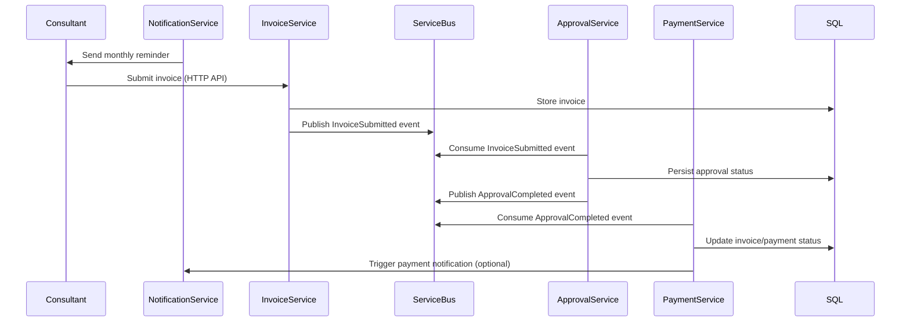
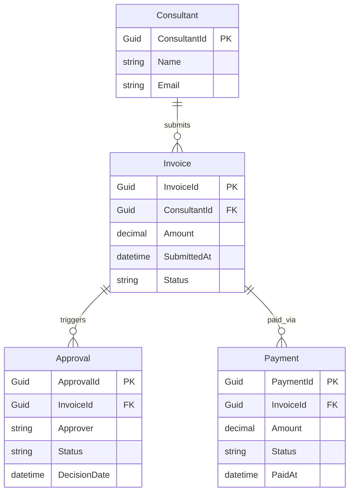

# System Architecture — Consultant Invoice & Notification System

---

## Overview

This system automates consultant invoice workflows using a set of microservices based on Azure Functions, Azure Durable Functions, Service Bus, and SQL Server.
It leverages event-driven architecture, CQRS, and SOLID design principles for scalability and maintainability.

---

## Microservices Architecture

```mermaid
flowchart LR
    N(NotificationService)
    I(InvoiceService)
    A(ApprovalService)
    P(PaymentService)
    S[(Azure Service Bus)]
    DB[(SQL Server)]

    N -- Reminder API/Events --> I
    I -- InvoiceSubmitted Event --> S
    S -- > A
    A -- ApprovalCompleted Event --> S
    S -- > P
    I -- Store Invoice --> DB
    A -- Store Approval --> DB
    P -- Update Payment --> DB
    N -- Notifications --> Consultants
```

---

## High-Level Workflow



---

## Entity Relationship Diagram (ERD)



---

## Patterns Used

- **Microservices & Event-Driven Architecture:** Services communicate via Service Bus events.
- **CQRS:** Separate API endpoints and data flows for commands and queries.
- **SOLID Principles:** Single Responsibility, Dependency Injection, maintainable code structure.
- **Durable Functions:** State and orchestration for approval workflow.
- **Repository Pattern:** Database interaction is abstracted for maintainability.
- **CI/CD:** Samples via GitHub Actions (see `.github/workflows/`).

---

## Technologies

| Component           | Tech Stack              |
|---------------------|------------------------|
| Compute             | Azure Function Apps    |
| Orchestration       | Azure Durable Functions|
| Messaging           | Azure Service Bus      |
| Persistence         | SQL Server, EF Core    |
| Diagrams            | Mermaid (Markdown)     |
| CI/CD               | GitHub Actions         |

---

## Further Documentation

- Feature details: See each microservice
- Examples: See README, sample requests
- Contribute: Fork, PR, raise an issue